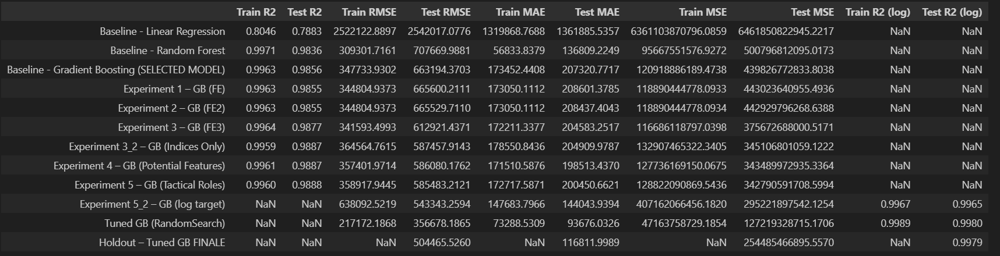

# Football Player Market Value Prediction (MLDP)

This project trains and evaluates a machine learning model to predict professional football players’ market value (EUR) from player attributes (age, overall/potential, wage, position, technical stats, etc.). It includes an end-to-end modelling pipeline (baseline → feature engineering → log-transform → hyperparameter tuning) and a Streamlit app for EDA + predictions.

## Dataset

Source: Kaggle — Football Players Data: https://www.kaggle.com/datasets/maso0dahmed/football-players-data

Target: value_euro

Key features: demographics (age/height/weight/nationality), contract (wage_euro), quality (overall_rating, potential), technical stats, and categorical attributes (foot/body type/positions).

## Cleaning & Leakage Handling

Dropped rows with missing value_euro (target cannot be imputed).

Dropped rows with missing wage_euro (~1.3%).

Dropped leakage-prone / sparse columns:

national team columns: national_team, national_rating, national_team_position, national_jersey_number

Cleaned Nationality and Body type as it has some issues

## Split Strategy (Train/Test/Holdout)

Unseen holdout: 316 players sampled once and saved as
unseen_holdout for SUBMISSION2.csv
(excluded from all model development until final evaluation)

Remaining data split once using train_test_split(..., random_state=42):

Train: 80%

Test: 20%

train_idx / test_idx reused across experiments to ensure fair comparison and avoid accidental leakage.

## Baselines

### Preprocessing:

Dropped non-predictive IDs/text columns (positions, name, full_name, birth_date)

nationality → nationality_code (LabelEncoder)

One-hot encoding for other categoricals (pd.get_dummies(..., drop_first=True))

### Models:

Linear Regression

Random Forest Regressor

Gradient Boosting Regressor

### Baseline conclusion:

Linear Regression underfits (errors in millions).

Tree ensembles perform strongly; Gradient Boosting chosen due to better generalisation (smaller train–test gap vs Random Forest).

## Feature Engineering (Experiments 1–5)

### All experiments overview:

Same train/test indices

One-hot encoding after feature creation

Trained/evaluated Gradient Boosting Regressor

Checked feature importances, permutation importance, and staged metrics

### Key engineered features:

#### Experiment 1:

body_type_clean: simplified body type

continent: mapped from nationality

#### Experiment 2:

Removed and tested without body_type_clean to see if it will make a difference

#### Experiment 3 and 3_2:

technical indices: pace_index, shooting_index, passing_index, dribbling_index, defending_index, physical_index

#### Experiement 4: 

growth: max(potential - overall_rating, 0)

#### Experiment 5 and 5_2 
position_group: broad role grouping (GK/Def/Mid/Attacker) and performing logging on the value euro

Notable result:

Experiment 3_2 “Indices-only” remained strong (test R² ~0.989), suggesting aggregated indices capture most technical variance.

## Hyperparameter Tuning

Model: GradientBoostingRegressor(random_state=42)

Search: RandomizedSearchCV (5-fold CV on training set only)

Params: n_estimators, learning_rate, max_depth, subsample

Scoring: RMSE in log-space (neg_root_mean_squared_error)

Tuned model summary (log-space):

Very high R² 

Train–test gap stays reasonable given valuation noise

## Final Holdout Evaluation (Unseen Set)

Holdout is processed with the exact same pipeline:

engineered features + OHE

Holdout results:

R² (log) ≈ 0.9979

RMSE ≈ €504k 

MAE ≈ €116k

(As expected, holdout RMSE is higher than internal test but still < €1M.)

## Final Results:

## Streamlit App

File: Football_Prediction.py

### Features:

Overview + dataset link

Data dictionary

EDA (from Experiment5_2_Dataset.csv) using Plotly

Predictor form → builds a one-row input, OHE encodes, aligns columns, predicts, converts back from log-space

value tiers + themed images when predicting

## How to run the application:

First install all relevant packages and dependencies using: pip install -r requirements.txt

python -m streamlit run Football_Prediction.py

OR

streamlit run Football_Prediction.py